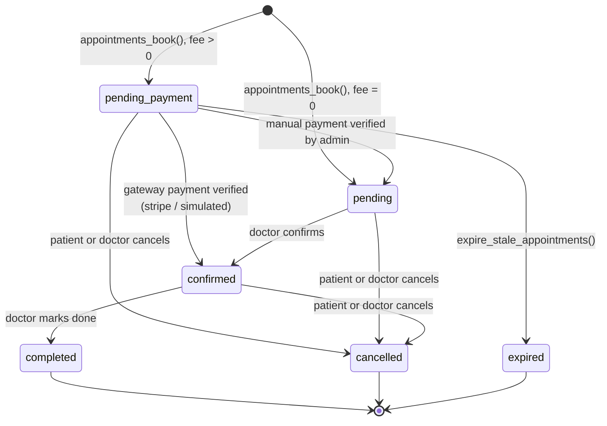

# Part 04 — Payments

**Phase 7.** Read `00_MASTER_PLAN.md` §2 Q4 and `PAYMENT_ARCHITECTURE_FIX.md`
before writing any code here. Rules R3 (frozen signatures), R9 (invariants in the
database) and R10 (`numeric(10,2)`, never float) are absolute in this part.

Prerequisites: Parts 01, 12, 02, 03, 06 and 07 are done. Payments come after
localization because every failure message in this part is user-facing and
bilingual on its first write.

The existing payment layer is not a prototype. It is a working escrow system
with a documented root-cause history. **This part extends it; it does not replace
it.** Read `PAYMENT_ARCHITECTURE_FIX.md` §1 fourteen root causes before you
"simplify" anything.

---

## 1. Architecture — one interface, four implementations

### 1.1 Why an abstraction, given Stripe already works

Today `PaymentService` (`app/lib/features/payment/data/payment_service.dart`,
502 lines) talks to Stripe Checkout and to the manual-transfer RPC. Both are
real; neither is selectable at runtime. Three things force an interface:

1. **D2 says credentials arrive later.** Until they do, Stripe cannot run at
   all. Something must take its place for the app to be demonstrable, and that
   something must exercise the *same* database paths or the demo proves nothing.
2. **SSLCommerz is the production target for Bangladesh** (master plan §2 Q4).
   `payment_method` already contains `'sslcommerz'`.
3. **Manual transfer is genuinely how small Bangladeshi platforms operate** and
   must stay a first-class path, not a fallback.

The abstraction lives in `app/lib/features/payment/domain/`. That directory
already exists and is **empty** — it and `domain/use_cases/`, `data/models/`,
`data/repositories/`, `presentation/screens/` and `presentation/providers/` were
scaffolded and never filled. Put the files here rather than creating a parallel
tree. `PaymentService` stays exactly where it is and keeps every public
signature (R3); the gateways call *into* it rather than around it.

### 1.2 The sealed result type

```dart
/// The outcome of one payment attempt, from any gateway.
///
/// Sealed so `switch` is exhaustive: a new outcome added later becomes a
/// compile error at every call site instead of a silently unhandled case.
/// That property is the reason this is a sealed class and not an enum with a
/// payload — the payloads differ per outcome and must not be nullable
/// everywhere.
sealed class PaymentResult {
  const PaymentResult();
}

/// Money has been taken and the server has recorded it. The appointment has
/// already moved; the caller refreshes rather than writing anything.
final class PaymentSucceeded extends PaymentResult {
  const PaymentSucceeded({
    required this.paymentId,
    required this.sessionId,
    required this.amount,
    required this.method,
  });

  final int paymentId;
  final String sessionId;
  final double amount;
  final PaymentMethod method;
}

/// Recorded, but not yet money. A manual transfer awaiting admin verification
/// lands here. NOT a failure — the UI shows "Awaiting verification", never an
/// error.
final class PaymentPendingVerification extends PaymentResult {
  const PaymentPendingVerification({
    required this.paymentId,
    required this.submittedAt,
  });

  final int paymentId;
  final DateTime submittedAt;
}

/// The gateway is running but refused this attempt. [failure] says whether a
/// retry could plausibly work; [reason] is already localized and safe to show.
final class PaymentFailed extends PaymentResult {
  const PaymentFailed({
    required this.failure,
    required this.reason,
    this.sessionId,
  });

  final PaymentFailure failure;
  final String reason;
  final String? sessionId;
}

/// The user backed out. Distinct from [PaymentFailed] because nothing went
/// wrong and the UI must not apologise — no red, no error icon, no retry
/// prompt. The appointment keeps its hold until it expires.
final class PaymentCancelled extends PaymentResult {
  const PaymentCancelled({this.sessionId});
  final String? sessionId;
}

/// The gateway handed control to a browser or app and the answer will arrive
/// later — by webhook, deep link, or the user returning. The caller must poll
/// or wait; it must NOT assume success.
///
/// This is the single most misused state in payment code. Returning from a
/// checkout page is not evidence of payment. Only the server is.
final class PaymentPendingRedirect extends PaymentResult {
  const PaymentPendingRedirect({
    required this.sessionId,
    required this.redirectUrl,
  });

  final String sessionId;
  final String redirectUrl;
}

/// The gateway is not configured. Distinct from [PaymentFailed] so the UI can
/// render the labelled "not configured" state (§2) instead of an error — this
/// is our deployment's condition, not the user's mistake.
final class PaymentNotConfigured extends PaymentResult {
  const PaymentNotConfigured({required this.gatewayName});
  final String gatewayName;
}
```

`PaymentFailure` and `PaymentMethod` already exist —
`payment_service.dart:44` and `models/appointment_models.dart`. Reuse them; do
not define parallel enums.

### 1.3 The interface

```dart
/// One way of taking money. Implementations differ in where the money goes,
/// never in what they write: every gateway drives the same `payment_sessions`
/// and `payments` rows and the same appointment transitions, because those are
/// owned by the database (R9).
abstract interface class PaymentGateway {
  /// Stable identifier written to `payments.gateway`. Must match a value the
  /// server recognises: 'simulated', 'stripe', 'manual', 'sslcommerz'.
  String get id;

  /// Localized name for the payment sheet.
  String displayName(AppLocalizations l10n);

  /// False when a required credential is missing. The UI reads this to decide
  /// between offering the method and showing the "not configured" state; it
  /// must never call [pay] on an unavailable gateway.
  bool get isAvailable;

  /// Which of the `payment_method` enum values this gateway can service.
  /// Drives the sheet's method list — no gateway invents a method name.
  Set<PaymentMethod> get supportedMethods;

  /// Starts payment for an appointment.
  ///
  /// [idempotencyKey] comes from an [IdempotencyToken] held by the screen and
  /// is REUSED across retries of the same attempt (§6). Passing a fresh key on
  /// a retry defeats the entire mechanism.
  Future<PaymentResult> pay({
    required int appointmentId,
    required PaymentMethod method,
    required double amount,
    required String idempotencyKey,
    String? transactionRef,
    String? senderNumber,
  });

  /// Re-reads authoritative state after a redirect or a resume. Returns the
  /// current truth, which may differ from what [pay] returned.
  Future<PaymentResult> checkStatus({required int appointmentId});
}
```

### 1.4 The four implementations

| Class | `id` | Methods | Credentials | Status |
|---|---|---|---|---|
| `SimulatedGateway` | `simulated` | bKash, Nagad, Rocket, Credit/Debit Card | **none** | New — §3 |
| `StripeCheckoutGateway` | `stripe` | Credit/Debit Card | `STRIPE_SECRET_KEY` (Edge Function) | Exists — wraps `PaymentService.startCardCheckout()` |
| `ManualTransferGateway` | `manual` | bKash, Nagad, Rocket, Bank Transfer, Cash | none | Exists — wraps `PaymentService.submitManualPayment()` |
| `SslcommerzGateway` | `sslcommerz` | sslcommerz | store id + password | Documented only — §1.6 |

The two "exists" rows are thin adapters. They must not duplicate logic: every
call goes through `PaymentService`, which remains the only Dart code that talks
to the payment RPCs (`payment_service.dart:1-27` explains why one owner
matters — three layers each holding part of the truth is what produced the
original bugs).

### 1.5 Selection is one flag

```dart
/// Which gateway serves card payments. The other methods are unaffected:
/// manual transfer is always available, and the simulated gateway can service
/// every method for demos.
enum PaymentMode { simulated, stripe, sslcommerz }

class PaymentConfig {
  const PaymentConfig._();

  /// THE ONE SWITCH.
  ///
  /// `simulated` until credentials arrive (D2). Changing this line is the
  /// entire migration to a live gateway — no screen, repository or SQL change.
  static const PaymentMode mode = PaymentMode.simulated;

  /// True only when the selected mode can actually take a card payment.
  /// Every card-payment surface reads this. See §2.
  static bool get isCardConfigured => switch (mode) {
        PaymentMode.simulated => true,   // always works, takes no real money
        PaymentMode.stripe => stripePublishableKey.isNotEmpty,
        PaymentMode.sslcommerz => sslcommerzStoreId.isNotEmpty,
      };

  /// True when no real money can move. Drives the SANDBOX banner (§3.2).
  static bool get isSandbox => mode == PaymentMode.simulated;
}
```

The provider that resolves it:

```dart
final paymentGatewayProvider = Provider<PaymentGateway>((ref) {
  final service = ref.watch(paymentServiceProvider);
  return switch (PaymentConfig.mode) {
    PaymentMode.simulated => SimulatedGateway(service, ref.watch(supabaseServiceProvider)),
    PaymentMode.stripe => StripeCheckoutGateway(service),
    PaymentMode.sslcommerz => SslcommerzGateway(service),
  };
});

/// Always available regardless of [PaymentConfig.mode] — a bKash transfer
/// with an admin checking the reference needs no gateway at all.
final manualGatewayProvider =
    Provider<PaymentGateway>((ref) => ManualTransferGateway(ref.watch(paymentServiceProvider)));
```

### 1.6 SSLCommerz — documented, not built

The Bangladeshi gateway, with a free sandbox at `sandbox.sslcommerz.com`. The
schema is already shaped for it: `payment_method` includes `'sslcommerz'`,
`payments.gateway` and `payments.gateway_transaction_id` exist, and
`payment_sessions.gateway_ref` is commented "SSLCommerz sessionkey returned by
the init call" (`schema.sql:703`).

Implementing it means a third Edge Function — `sslcommerz-init`, mirroring
`create-checkout-session`: call `/gwprocess/v4/api.php` with store id, store
password, amount and `tran_id`, receive `GatewayPageURL`, store the session key
in `payment_sessions.gateway_ref`, and open the URL. Validation is a
server-to-server `validationserverAPI` call on return — **never trust the
browser redirect**, which is why the session key is stored rather than the
redirect being believed.

Write `SslcommerzGateway` as a class whose `isAvailable` returns false and whose
`pay()` returns `PaymentNotConfigured`. That is a complete, correct
implementation of "not configured yet", and it keeps the switch exhaustive.

---

## 2. The credential slots (decision D2)

> User's words: *"now, just build it and keep the place empty, i will provide
> the credentials later"*

Every slot is created, named, commented and **left empty**. The requirement is
not "it compiles with empty strings" — it is that **the app starts, signs in,
navigates every screen, books an appointment, and shows a labelled state where
card payment would be, with every slot empty.** Never a crash, never a blank
screen, never a raw exception string.

### 2.1 Client-side slots — one file

All of them live in `app/lib/features/payment/domain/payment_config.dart`,
alongside `PaymentMode` from §1.5. One file so `grep -n '= .;' payment_config.dart`
answers "what is still empty".

```dart
  // ===================================================================
  // CREDENTIAL SLOTS — every one is EMPTY on purpose (master plan D2).
  //
  // NOTHING SECRET GOES IN THIS FILE (R6). These are publishable values,
  // designed to ship in a client binary. A key that must stay secret goes
  // into an Edge Function secret — see §2.3 — and the app never sees it.
  //
  // After pasting a value, run the §2.4 checklist. The app must behave
  // identically except that the card option becomes live.
  // ===================================================================

  /// Stripe PUBLISHABLE key. Starts `pk_test_` (test) or `pk_live_` (live).
  ///
  /// WHERE TO GET IT: dashboard.stripe.com → Developers → API keys →
  /// "Publishable key". Copy the PUBLISHABLE one. The Secret key on the same
  /// page must NEVER be pasted here — it belongs in an Edge Function secret.
  ///
  /// Only used to render the card brand and last four digits after a payment;
  /// the charge itself is created server-side. Leaving it empty costs cosmetics,
  /// not function.
  static const String stripePublishableKey = '';

  /// SSLCommerz store id, e.g. `ayurbd0live`.
  ///
  /// WHERE TO GET IT: sslcommerz.com merchant panel → My Stores → Store ID.
  /// For the free sandbox, register at developer.sslcommerz.com and use the
  /// sandbox store id.
  ///
  /// The store PASSWORD is a secret and is NOT here — Edge Function only.
  static const String sslcommerzStoreId = '';

  /// True for the SSLCommerz sandbox host, false for live. Ignored while
  /// [sslcommerzStoreId] is empty.
  static const bool sslcommerzSandbox = true;

  /// Platform bKash/Nagad/Rocket merchant numbers shown on the manual-transfer
  /// sheet: "send the money to this number, then enter the transaction id".
  ///
  /// WHERE TO GET THEM: the platform's own merchant accounts. Not secret —
  /// they are printed for the payer to read.
  ///
  /// Empty means the manual sheet shows "Mobile transfer is not set up yet"
  /// and offers only Cash and Bank Transfer. It must NOT show an empty box a
  /// patient might send money into.
  static const String bkashMerchantNumber = '';
  static const String nagadMerchantNumber = '';
  static const String rocketMerchantNumber = '';

  /// Platform bank details for the Bank Transfer method. Same rule: empty
  /// hides the method rather than rendering a blank card.
  static const String bankAccountName = '';
  static const String bankAccountNumber = '';
  static const String bankName = '';
  static const String bankBranch = '';
```

### 2.2 `isCardConfigured` and what every screen owes it

```dart
  /// True only when a card payment can actually be taken right now.
  ///
  /// Read this before OFFERING card payment, not after a failure. The
  /// difference matters: a disabled, explained option is honest, and a live
  /// button that fails with a server error looks broken.
  static bool get isCardConfigured => switch (mode) {
        PaymentMode.simulated => true,
        PaymentMode.stripe => stripePublishableKey.isNotEmpty,
        PaymentMode.sslcommerz => sslcommerzStoreId.isNotEmpty,
      };
```

`stripePublishableKey` is a **proxy** for the server-side secret, which the
client cannot see. If the publishable key is set but the Edge Function's
`STRIPE_SECRET_KEY` is not, the function returns `STRIPE_NOT_CONFIGURED`,
`failureForCode` (`payment_service.dart:320`) maps it to
`PaymentFailure.gatewayUnavailable`, and the UI must render the **same**
"not configured" state as the client-side check produces. Both paths, one
appearance — otherwise the misconfiguration presents as an intermittent bug.

Required behaviour on every card-payment surface:

| Surface | With a configured card gateway | With every slot empty |
|---|---|---|
| Payment method sheet | "Card" row, enabled | "Card" row present, **disabled**, subtitle "Online card payment is not configured yet", trailing info icon |
| Info icon tap | — | Dialog: what it means, that other methods work, "Use bKash instead" action |
| `/payment-success` | Polls until verified | Unreachable; if deep-linked, re-reads the appointment and shows its real state |
| Appointment detail Pay button | Opens the sheet | Opens the sheet — manual methods still work |
| Pharmacy checkout | Card option live | Same disabled row |
| Admin payments screen | Full ledger | Full ledger plus a banner: "Card payments are not configured. Manual verification is unaffected." |

**Never hide the card option entirely.** A hidden option is indistinguishable
from a bug; a visible, explained, disabled one tells both the user and the next
developer exactly what is going on.

### 2.3 Server-side secrets, for later

Set now as empty strings so they appear in `supabase secrets list` (Part 02
§7.5). Fill in when the user provides them, then redeploy — a Deno isolate reads
`Deno.env` at boot, so a running function keeps the old value.

| Secret | Used by | Where to get it | D2 |
|---|---|---|---|
| `STRIPE_SECRET_KEY` | `create-checkout-session`, `stripe-webhook` | Stripe → Developers → API keys → **Secret key** (`sk_test_…`) | **EMPTY** |
| `STRIPE_WEBHOOK_SECRET` | `stripe-webhook` | Stripe → Developers → Webhooks → your endpoint → **Signing secret** (`whsec_…`) | **EMPTY** |
| `APP_URL` | both | Your deployed web origin; fallback return target | **EMPTY** |
| `APP_WEB_ORIGINS` | `create-checkout-session` | Comma-separated allowlist of web origins (Part 02 §5.3) | **EMPTY** |
| `SSLCOMMERZ_STORE_PASSWD` | `sslcommerz-init` (unbuilt) | SSLCommerz merchant panel | **EMPTY** |

`SUPABASE_URL` and `SUPABASE_SERVICE_ROLE_KEY` are injected by the platform.
Never set them by hand and never let either reach `app_config.dart` —
`assertValidBackendConfig()` (`app_config.dart:56`) throws at startup if the
shipped key looks like a secret, and that check must not be weakened.

### 2.4 Acceptance test for the empty state

Run this with **every slot empty**. It is the definition of done for §2 and
appears in Part 11's matrix.

1. `flutter run` — the app starts. No exception in the console at boot.
2. Sign in as a patient. Land on `/home`.
3. Open a doctor, book a slot. The appointment is created in `pending_payment`.
4. Tap Pay. The sheet opens. The card row is present, disabled, and explains
   itself in the current locale.
5. Switch to বাংলা. The explanation is in Bangla.
6. Choose bKash. With `bkashMerchantNumber` empty, the sheet says mobile
   transfer is not set up — it does **not** show an empty number box.
7. Choose Cash. Submit. A `payments` row appears with
   `payment_status='pending'`. The appointment shows "Awaiting verification".
8. Sign in as admin, verify it. The appointment moves to paid.
9. Deep-link `/payment-success?appointment_id=<id>` directly. It re-reads the
   appointment and shows its real state rather than a spinner forever.
10. `flutter analyze` — zero errors, zero warnings.

Any step that crashes, blanks, or shows a raw exception string fails the whole
part.

---

## 3. The simulated sandbox

This is what makes the app demonstrable on the day it is built, with no
merchant account and no credentials. It is not a mock. **It writes the same
rows, fires the same triggers, and drives the same appointment transitions as
Stripe does** — the only thing that does not happen is money moving.

That fidelity is the whole point. A mock that short-circuits the database
proves the UI renders; a simulator that goes through `payments` and
`payment_sessions` proves the *system* works, and when real credentials arrive
the only change is one line in `PaymentConfig`.

### 3.1 Why the client cannot simply insert a verified payment

`record_payment_split()` — the function the Stripe webhook uses to write a
`verified` payment — is deliberately unreachable from the app:

```
revoke all on function public.record_payment_split(bigint, numeric, varchar, uuid, varchar, varchar)
  from public, anon, authenticated;
grant execute on function public.record_payment_split(...) to service_role;
```

(`20260809000002_payment_architecture_fix.sql:1936-1943`.) And
`guard_payments_insert()` (:288) forces any client-supplied `payment_status`
back to `'pending'`. A simulated gateway that writes `verified` from Dart is
therefore impossible **and must stay impossible** — otherwise a repackaged APK
gets free appointments.

So the simulator needs its own server-side entry point, and that entry point
needs a switch the client cannot flip.

### 3.2 `simulate_payment_outcome()` — the one new RPC

Add to `supabase/migrations/<ts>_payment_sandbox.sql`. It is
`security definer`, granted to `authenticated`, and **refuses to do anything
unless the database itself is in sandbox mode**.

```sql
-- Sandbox switch. Lives in the database, not the client, because a
-- constant compiled into an APK is a suggestion and a row is a fact.
-- Production sets this to false and the simulator becomes inert no matter
-- what the app binary says.
create table if not exists public.payment_sandbox (
  id           boolean primary key default true,
  enabled      boolean not null default true,
  updated_at   timestamptz not null default now(),
  constraint payment_sandbox_singleton check (id)
);

insert into public.payment_sandbox (id, enabled) values (true, true)
  on conflict (id) do nothing;

alter table public.payment_sandbox enable row level security;

-- Everyone signed in may READ it (the app needs to know whether to show
-- the SANDBOX banner). Nobody but an administrator may WRITE it.
create policy payment_sandbox_select_authenticated on public.payment_sandbox
  for select to authenticated using (true);
create policy payment_sandbox_update_admin on public.payment_sandbox
  for update to authenticated
  using ((select public.is_admin())) with check ((select public.is_admin()));

create or replace function public.payment_sandbox_enabled()
returns boolean
language sql
stable
security definer
set search_path = ''
as $$ select coalesce((select enabled from public.payment_sandbox where id), false) $$;
```

The `insert` above seeds a *configuration* row, not business data, so it does
not violate R1 (zero INSERTs for business data). Say so in the migration
comment or a reviewer will flag it.

### 3.3 The outcomes

Five buttons, five server behaviours. The names are the ones a Bangladeshi
mobile-banking user actually sees, which is why the list is not the generic
"success / failure".

| Button (EN / বাংলা) | `p_outcome` | What the server writes | Appointment after |
|---|---|---|---|
| Payment successful / পেমেন্ট সফল | `success` | `payments` row `verified` + split + payout; session → `paid` | `confirmed`, `payment_status='paid'` |
| Insufficient balance / পর্যাপ্ত ব্যালেন্স নেই | `insufficient_funds` | session → `failed`; **no** `payments` row | unchanged (`pending_payment`) |
| Wrong PIN / ভুল পিন | `wrong_pin` | session → `failed`; no `payments` row | unchanged |
| Timed out / সময় শেষ | `timeout` | session → `expired`; no `payments` row | unchanged |
| Cancelled / বাতিল করা হয়েছে | `cancelled` | session → `failed`, note `user_cancelled` | unchanged |

The three failures differ only in the message. They are separate buttons
because the *UI* must differ: `insufficient_funds` and `wrong_pin` are
retryable (`PaymentFailure.isRetryable`, `payment_service.dart:44`) and offer
"Try again"; `cancelled` offers nothing and shows no error styling
(`PaymentCancelled`, §1.2); `timeout` offers "Try again" and additionally
tells the user their slot is still held until the hold expires.

**No outcome ever leaves the appointment in a worse state than it started.**
A failed simulated payment must not cancel the booking — the hold expires on
its own via `expire_stale_appointments()`
(`20260809000002_payment_architecture_fix.sql:1725`).

### 3.4 The function

```sql
create or replace function public.simulate_payment_outcome(
  p_appointment_id  bigint,
  p_outcome         text,
  p_method          public.payment_method default 'Credit/Debit Card',
  p_reference       text default null,
  p_idempotency_key text default null
)
returns jsonb
language plpgsql
security definer
set search_path = ''
as $$
declare
  v_user    uuid := (select auth.uid());
  v_appt    public.appointments%rowtype;
  v_payment public.payments%rowtype;
  v_session public.payment_sessions%rowtype;
  v_ref     text := coalesce(nullif(btrim(p_reference), ''),
                             'SIM-' || upper(substr(md5(random()::text), 1, 10)));
  v_prev    text;
begin
  if not public.payment_sandbox_enabled() then
    raise exception 'The payment sandbox is switched off.' using errcode = '42501';
  end if;
  if v_user is null then
    raise exception 'not authenticated' using errcode = '42501';
  end if;
  if p_outcome not in ('success','insufficient_funds','wrong_pin','timeout','cancelled') then
    raise exception 'unknown simulated outcome %', p_outcome using errcode = '22023';
  end if;

  -- Same lock the real paths take, so a double tap queues rather than races.
  perform pg_advisory_xact_lock(
    hashtext('ayur:appointment_payment:' || p_appointment_id::text));

  select * into v_appt from public.appointments where id = p_appointment_id;
  if not found then
    raise exception 'This appointment could not be found.' using errcode = 'PGRST116';
  end if;
  if v_appt.patient_id is distinct from v_user then
    raise exception 'This appointment belongs to another patient.' using errcode = '42501';
  end if;

  -- Idempotency: the same key replays its own answer instead of paying twice.
  if p_idempotency_key is not null then
    select * into v_payment from public.payments
     where appointment_id = p_appointment_id
       and transaction_id = p_idempotency_key;
    if found then
      return jsonb_build_object('replayed', true, 'outcome', 'success',
                                'payment_id', v_payment.id);
    end if;
  end if;

  perform public.assert_appointment_payable(p_appointment_id);

  v_prev := public.trusted_path_begin();

  insert into public.payment_sessions
    (user_id, appointment_id, amount, gateway, gateway_ref, gateway_txn_id,
     status, expires_at)
  values (v_user, p_appointment_id, v_appt.fee, 'simulated', v_ref, v_ref,
          'initiated', now() + interval '15 minutes')
  returning * into v_session;

  if p_outcome = 'success' then
    -- payment_status='verified' at INSERT: payments_apply_verification()
    -- (PART 9) does the split, the payout and the appointment transition,
    -- exactly as it does for a Stripe webhook.
    insert into public.payments
      (appointment_id, user_id, amount, payment_method, transaction_id,
       payment_status, verified_at, verified_by, gateway, gateway_transaction_id,
       notes)
    values
      (p_appointment_id, v_user, v_appt.fee, p_method,
       coalesce(p_idempotency_key, v_ref), 'verified', now(), null,
       'simulated', v_ref,
       'SANDBOX — simulated payment, no money moved.')
    returning * into v_payment;

    perform public.trusted_path_end(v_prev);
    return jsonb_build_object('replayed', false, 'outcome', 'success',
                              'payment_id', v_payment.id,
                              'session_id', v_session.id::text,
                              'amount', v_appt.fee);
  end if;

  update public.payment_sessions
     set status = case when p_outcome = 'timeout' then 'expired' else 'failed' end,
         notes_hint = p_outcome,
         updated_at = now()
   where id = v_session.id;

  perform public.trusted_path_end(v_prev);

  return jsonb_build_object('replayed', false, 'outcome', p_outcome,
                            'session_id', v_session.id::text);
end;
$$;

grant execute on function public.simulate_payment_outcome(
  bigint, text, public.payment_method, text, text) to authenticated;
```

Three things to notice, because getting any of them wrong reintroduces a bug
this codebase already fixed:

1. **`trusted_path_begin()` / `_end()` wrap the writes.** Without it,
   `appointments_guard_transition()` (:661) refuses the `pending_payment →
   confirmed` move, because a client-originated status change may only be
   `cancelled`. The marker is what tells the guard "this write came from an
   authoritative server path".
2. **The INSERT carries `payment_status='verified'`, not an UPDATE
   afterwards.** `payments_apply_verification` fires `before insert` *and*
   `before update` precisely because the original was update-only and
   `record_payment_split` never triggered it — that was root cause #9. An
   insert-then-update simulator would work by accident today and break the
   moment the trigger is tidied.
3. **`gateway='simulated'` is set**, so `payments_apply_verification` takes the
   gateway branch and moves the appointment to `confirmed` rather than
   `pending`. A simulated card payment must land where a real card payment
   lands or the demo teaches the wrong flow.

### 3.5 The Dart side

`app/lib/features/payment/data/simulated_gateway.dart`:

```dart
/// A gateway that exercises every real database path without moving money.
///
/// Not a mock: `pay()` returns [PaymentPendingRedirect]-free results only
/// because the "hosted page" is a bottom sheet in this app. Everything the
/// server does is identical to a live gateway.
class SimulatedGateway implements PaymentGateway {
  const SimulatedGateway(this._payments, this._supabase);

  final PaymentService _payments;
  final SupabaseService _supabase;

  @override
  String get id => 'simulated';

  @override
  bool get isAvailable => true;

  @override
  String displayName(AppLocalizations l10n) => l10n.paymentSandboxGateway;

  @override
  Set<PaymentMethod> get supportedMethods => const {
        PaymentMethod.bkash,
        PaymentMethod.nagad,
        PaymentMethod.rocket,
        PaymentMethod.card,
      };

  /// [outcome] is chosen by the operator in the sandbox sheet. There is no
  /// default: the point of the sandbox is that the tester decides.
  Future<PaymentResult> simulate({
    required int appointmentId,
    required PaymentMethod method,
    required SimulatedOutcome outcome,
    required String idempotencyKey,
    String? reference,
  }) => _supabase.guard(() async { /* rpc('simulate_payment_outcome', …) */ });
}
```

`SupabaseService.guard()` is what turns a `PostgrestException` into the single
`ApiException` the other 42 files already catch — do not add a second error
type here.

Map the RPC's JSON onto the sealed result:

| `outcome` in the response | Dart result |
|---|---|
| `success` | `PaymentSucceeded(paymentId, sessionId, amount, method)` |
| `insufficient_funds` | `PaymentFailed(PaymentFailure.unknown, l10n.paySimInsufficient, sessionId)` |
| `wrong_pin` | `PaymentFailed(PaymentFailure.unknown, l10n.paySimWrongPin, sessionId)` |
| `timeout` | `PaymentFailed(PaymentFailure.network, l10n.paySimTimeout, sessionId)` |
| `cancelled` | `PaymentCancelled(sessionId)` |

`PaymentFailure.network` for the timeout is deliberate: it is the value whose
`isRetryable` is already true and whose copy already says "check your
connection and try again".

### 3.6 The sandbox sheet

`app/lib/features/payment/presentation/widgets/sandbox_payment_sheet.dart`.
Shown by the payment sheet when `PaymentConfig.isSandbox`.

Layout, top to bottom:

1. **The banner. Non-dismissible, unmissable.** Amber container, warning icon,
   text `l10n.sandboxBanner` = "SANDBOX — no real money will be taken" /
   "স্যান্ডবক্স — কোনো প্রকৃত টাকা কাটা হবে না". This is the single most
   important widget in the sheet: a tester who forgets they are in the sandbox
   will report a payment bug that does not exist, and a real user who ever sees
   this screen must understand instantly that nothing was charged.
2. **Amount**, `৳` + the appointment fee, formatted through the shared money
   formatter so Bangla numerals appear in the Bangla locale.
3. **Method chooser** — the four supported methods as radio rows with their
   brand colours, matching the live sheet's layout exactly.
4. **Reference field**, optional, hint "e.g. TRX12345678". Left empty the
   server mints `SIM-XXXXXXXXXX`. Present so testers can rehearse the
   manual-transfer habit of copying a reference.
5. **Five outcome buttons** in a `Column` of full-width tonal buttons, the
   success one `FilledButton` and visually first, the four failures
   `OutlinedButton`. Each carries an icon and its localized label from §3.3.
6. **Footer**: "This screen exists because online payment credentials have not
   been added yet." with the same wording as the disabled-card dialog in §2.2,
   so the two states read as one story.

While the RPC is in flight, all five buttons disable and the pressed one shows
a progress indicator — R5's loading state, and the guard against a double tap
that the idempotency key backs up in the database (§6).

### 3.7 Turning it off

Production deployment runs one statement:

```sql
update public.payment_sandbox set enabled = false, updated_at = now() where id;
```

After that `simulate_payment_outcome()` raises `42501` regardless of the app
binary, and `PaymentConfig.mode` is switched to `stripe` or `sslcommerz`. Both
halves are required: the flag alone leaves the app offering a sandbox sheet
that now fails, and the constant alone leaves an exploitable RPC live. Part 11's
release checklist asserts both.

---

## 4. Commission and escrow

> Brief item 3: *"change a amount on payment system"* — the admin sets the
> platform's cut.

### 4.1 What already exists

Half of this is built. Do not rebuild it (R2, D1).

| Thing | Where | State |
|---|---|---|
| Per-provider rate | `commission_percentage numeric(5,2) not null default 2.00` on `doctors` (`schema.sql:330`), `hospitals` (:398), `clinics` (:454), `pharmacies` (:507), each with a 0–100 CHECK | **exists** |
| Frozen copy on the payout | `provider_payouts.commission_percentage` (:870) | **exists** |
| Split columns | `payments.admin_share` / `provider_share` (:620), `orders.admin_share` / `provider_share` (:803) | **exists** |
| Reconciliation CHECK | `payments_split_check`, `orders_split_check` — both assert `admin_share + provider_share = amount` (or `= total`) | **exists** |
| Appointment split trigger | `payments_apply_verification()` (`20260809000002:1040`) | **exists** |
| Order split trigger | `orders_apply_verification()` (`schema.sql:1810`) | **exists** |
| Payout ledger | `provider_payouts`, one row per payment or per order, enforced by `provider_payouts_source_check` and two partial unique indexes | **exists** |
| **Per-category default** | — | **missing — build it** |
| **Admin UI to change either** | — | **missing — build it** |
| **Settlement action** | `provider_payouts.status` moves `pending → paid` | **no UI — build it** |

### 4.2 Category defaults without breaking per-provider rates

The brief asks for a percentage *per category*; the schema has one *per
provider row*. Both are wanted: a category default that applies to every new
provider, and a per-provider override for a negotiated rate. R2 forbids
removing the existing column, so add the default beside it.

```sql
create table public.commission_settings (
  category   text primary key,
  percentage numeric(5,2) not null default 2.00,
  updated_at timestamptz not null default now(),
  updated_by uuid references public.users (id) on delete set null,
  constraint commission_settings_category_check
    check (category in ('doctor', 'hospital', 'clinic', 'pharmacy')),
  constraint commission_settings_percentage_check
    check (percentage >= 0 and percentage <= 100)
);
```

**Blood banks are absent on purpose.** Blood is donated, not sold; a platform
fee on a blood request would be indefensible and in most readings illegal. The
CHECK makes it impossible to add one by accident. If someone later asks why,
this paragraph is the answer.

Seeding the four rows is configuration, not business data — permitted under R1,
same as `payment_sandbox` in §3.2. Note it in the migration comment.

RLS: readable by `authenticated` (a doctor is entitled to know the platform's
cut), writable only by an admin. Full policy text in Part 02 §2.

New provider rows take the category default through a `before insert` trigger
on each provider table that fills `commission_percentage` when the inserter did
not set it. Existing rows are untouched — changing a live provider's negotiated
rate silently would be a data-integrity incident, not a feature.

### 4.3 Freezing, and why it is not optional

The rate is read **at the moment of verification** and written onto the row:

```sql
  -- from payments_apply_verification(), 20260809000002:1085-1094
  select d.commission_percentage, u.id
    into v_commission, v_doctor_user
    from public.appointments a
    join public.doctors d on d.id = a.doctor_id
    join public.users   u on u.id = d.user_id
   where a.id = new.appointment_id;

  v_admin    := round(new.amount * coalesce(v_commission, 0) / 100.0, 2);
  v_provider := new.amount - v_admin;
```

`admin_share` and `provider_share` are stored numbers, and
`provider_payouts.commission_percentage` keeps the rate that produced them. So
an admin who raises the doctor commission from 2% to 5% next month changes
*future* payments only. Last month's ledger still adds up, and last month's
receipts still match the bank.

The alternative — computing the split on read by joining the current rate —
would silently rewrite financial history the first time anyone edited a
percentage. Every reconciliation would then disagree with every printed
receipt. This is the single most important paragraph in this part.

Note the rounding order: `admin_share` is rounded, and `provider_share` is the
**remainder**, not a second rounded product. Rounding both independently makes
them fail to sum to `amount` on values like ৳ 333.33, and `payments_split_check`
would reject the row. Keep the subtraction.

### 4.4 The escrow flow, end to end

```
patient pays ৳1000
   │
   ├─ payments row:      amount 1000, admin_share 20, provider_share 980
   ├─ appointment:       payment_status 'paid'
   └─ provider_payouts:  provider_user_id = doctor's user, amount 980,
                         commission_percentage 20.00→2.00, status 'pending'
                                │
                                │  admin settles (bank transfer / bKash, outside the app)
                                ▼
                         status 'paid', paid_at, paid_by, payout_note
```

The platform holds the money between those two steps. That is what "escrow"
means here, and it is why `provider_payouts` exists as a ledger rather than the
payout being implied by a join.

**Admin screens to build** (Part 09 owns the chrome; this part owns the rules):

| Screen | Route | Does |
|---|---|---|
| Commission settings | `/admin/commissions` | Edit the four category defaults; list providers with a non-default rate and edit each |
| Payouts | `/admin/payouts` | `provider_payouts` filtered by status; per provider, total pending; "Mark paid" with a required note |
| Payments ledger | existing admin payments screen | Add `admin_share` / `provider_share` columns and a period total |

"Mark paid" writes `status='paid'`, `paid_at=now()`, `paid_by=auth.uid()` and
the note. It never deletes and never edits `amount` — a settled payout is a
financial record. Reversal is a separate action writing `status='reversed'`,
which is why the CHECK allows that third value.

### 4.5 Production note — the legal shape of this

The technical design is sound. The regulatory position is not automatic: in
Bangladesh, holding third-party funds and settling them later is payment
aggregation, and Bangladesh Bank licenses PSO/PSP operators for it. A platform
running real escrow at scale needs either that licence or a settlement
arrangement with a licensed gateway (SSLCommerz and bKash both offer split
settlement, which moves the holding out of your hands entirely).

This does not change any code here — `provider_payouts` is exactly the ledger a
split-settlement integration reconciles against. It is written down so nobody
launches assuming the question was considered and answered. Flag it to the
owner; it is a business decision, not an engineering one.

### 4.6 Fourteen bugs that must not come back

`PAYMENT_ARCHITECTURE_FIX.md` §1 documents fourteen defects. These are the ones
a well-meaning refactor is most likely to reintroduce. Read them before
touching the payment SQL.

| # | The defect | The trap |
|---|---|---|
| A | `guard_orders_insert()` tested `session_user <> 'authenticator'` to detect a trusted call. `SECURITY DEFINER` changes `current_user`, not `session_user`, and PostgREST always logs in as `authenticator` — so `place_order()` was unreachable by construction | Anything that "simplifies" `trusted_path_begin/_end` back to a `session_user` or `current_user` test breaks every write path at once |
| B | `guard_appointments_insert()` re-stamped `new.status := 'pending'`, while `create-checkout-session` required `pending_payment`. The state the server demanded could not exist | Do not make the guard unconditional again. It now *derives* the opening state from the fee: fee > 0 → `pending_payment`, fee = 0 → `pending` |
| C | `guard_admin_only_columns` blocked `payments_apply_verification()`'s own write | Fixed by A. If you replace the marker, this breaks too and the symptom looks unrelated |
| D | `20260808000001` never applied — eight `end if` without semicolons, `alter type … add value` in the same transaction, wrong column names. It is now a documented no-op | Do not "restore" it. Its real content lives in `20260809000002` |
| E–G | `record_payment_split` used non-existent columns; `confirm_appointment` assigned uuid to bigint; `expire_stale_appointments` swept `pending` only, so `pending_payment` bookings held their slot forever | Any new sweeper must cover both statuses |
| H | `place_order()` had no idempotency key and no lock; a double tap placed two real orders | §6 |
| J | `schema.sql` and `migrations/` both define the same functions and `schema.sql` still holds pre-fix definitions. Applying `schema.sql` *after* the migrations silently regresses everything | **Live risk.** Never run `schema.sql` on a migrated database. Part 02 §7 states the order |
| K | The webhook logged RPC failures and returned `200`. To Stripe `2xx` means never redeliver — a transient error permanently lost a captured payment | Never return 2xx on an unhandled error. Return 5xx and let Stripe retry |
| L | Flutter had no filter chip, colour or icon for `pending_payment` or `expired`, and `canPay` did not exclude `expired` | §5's table is exhaustive for exactly this reason |
| N | Unique-index violations fell through to "That already exists.", which tells a user nothing and invites another tap | Every new unique index needs a branch in `_uniqueMessage()` |

---

## 5. The state machine

Two independent columns on `appointments` (`schema.sql:547`):

- `status appointment_status` — `pending`, `pending_payment`, `confirmed`,
  `completed`, `cancelled`, `expired`
- `payment_status payment_state` — `pending`, `paid`, `refunded`
  (`schema.sql:202` — three values, **not** the same enum as
  `payments.payment_status`, which is `payment_verification_status`:
  `pending`, `verified`, `rejected`)

Three enums, two of them called "payment status". Confusing them is the most
common mistake in this codebase. Whenever you write the phrase, name the table.

### 5.1 Legal transitions

Enforced by `appointments_guard_transition()`
(`20260809000002_payment_architecture_fix.sql:661`), which is the authority.
This table restates it; if they ever disagree, the trigger is right.

| From | May become | Who may do it |
|---|---|---|
| `pending_payment` | `pending`, `confirmed`, `cancelled`, `expired` | trusted path; patient/doctor may `cancelled` |
| `pending` | `confirmed`, `cancelled`, `expired` | doctor may `confirmed`; patient/doctor may `cancelled` |
| `confirmed` | `completed`, `cancelled`, `expired` | doctor may `completed`; patient/doctor may `cancelled` |
| `completed` | — terminal | — |
| `cancelled` | — terminal | — |
| `expired` | — terminal | — |

An admin and a direct psql session bypass the table — deliberately, for repair.
Everything else, **including the app's own RPCs**, obeys it: "a state machine
our own server code can sidestep is not a state machine" (the trigger's own
comment).

### 5.2 The two happy paths



The fork out of `pending_payment` is not arbitrary. `payments_apply_verification`
(`:1112-1127`) reads it off `v_is_gateway`:

- **Gateway** (Stripe, simulated, SSLCommerz): the platform already holds the
  money and the patient has already been shown "Appointment Confirmed" on the
  gateway's own success page. Contradicting that with "awaiting doctor" would be
  a lie about a completed transaction. → `confirmed`.
- **Manual** (bKash reference an admin eyeballed, cash, bank transfer): the
  escrow rule stands — the *provider* confirms. → `pending`, which means
  exactly "paid, awaiting the doctor".

### 5.3 Every failure, and what happens

| Scenario | Server truth | What the app must do |
|---|---|---|
| Network drops before the RPC is sent | Nothing written | `PaymentFailed(network)`. Retry with the **same** idempotency key |
| Network drops after the RPC ran, before the response arrived | Payment may exist | Retry with the same key → `submit_manual_payment` returns the existing pending row; `simulate_payment_outcome` returns `replayed: true`. Never a second charge |
| App killed after the Stripe redirect, before returning | Webhook still fires | On next launch, `/my-appointments` re-reads; the appointment is already `confirmed`. No client action needed |
| User returns from checkout before the webhook lands | Session `initiated`, no payment row | `/payment-success` polls `payment_health_check` with backoff (§5.4). Shows "Confirming your payment…", never "failed" |
| Webhook lands before the user returns | Already `confirmed` | Return page reads the real state and shows success immediately |
| Double-tap Pay | Advisory lock serialises; second call sees the first's row | Button disabled while in flight; same key on both |
| Two devices pay at once | `uq_payments_pending_appt` (one pending per appointment) and `uq_payment_sessions_active_appt` (one live session) | Loser gets a unique violation mapped by `_uniqueMessage()` to "A payment for this appointment is already being processed." |
| Manual payment verified while a card is in flight | `record_payment_split` finds a verified payment and **returns it** rather than charging | Card page shows already-paid state |
| Card completes while a manual submission is pending | `record_payment_split` rejects the pending manual row with "Superseded by an online card payment." | Patient sees the card payment; the manual one shows as superseded, not failed |
| Hold expires unpaid | `expire_stale_appointments()` → `expired` | Pay button gone. `appointment_payability` returns `APPOINTMENT_NOT_PAYABLE` |
| Payment for a cancelled appointment | `payments_apply_verification` raises "This appointment is cancelled or expired and can no longer be verified." | Show the message; offer refund contact, not retry |
| Amount mismatch between gateway and fee | `record_payment_split` raises rather than guessing | Log it, show "Please contact support", do not retry. A silent correction here would hide fraud |
| Refund | §8 | |

### 5.4 Before you offer a Pay button

Never decide payability in Dart. `appointment_payability()`
(`20260809000002:828`) is `stable` `security definer` and returns a code the UI
maps directly:

| `code` | `PaymentFailure` | Button |
|---|---|---|
| `PAYABLE` | `none` | Pay, enabled |
| `APPOINTMENT_NOT_FOUND` | `notFound` | hidden |
| `APPOINTMENT_NOT_PAYABLE` | `notPayable` | hidden |
| `ALREADY_PAID` | `alreadyPaid` | replaced by "Paid" + receipt link |
| `ALREADY_REFUNDED` | `alreadyRefunded` | replaced by "Refunded" |
| `NO_FEE` | `noFee` | hidden — nothing to pay |

`APPOINTMENT_NOT_FOUND` is returned for a stranger's appointment as well as a
missing one, deliberately, so the function is not an enumeration oracle. Do not
"improve" that into a 403 — the indistinguishability is the security property.

---

## 6. Idempotency

`app/lib/core/utils/idempotency.dart` already exists and its doc comment states
the rule this section enforces:

> One attempt = one thing the user meant to do. It keeps one key.
> One request = one network round trip. An attempt may need several.
> So a retry after a timeout deliberately reuses the key.

`renew()` is called **only when the attempt has genuinely settled** — a success,
or a terminal failure the user cannot retry into. Calling it after a network
timeout defeats the entire mechanism, which is why this is spelled out twice.

### 6.1 Where the key is held

In the **screen's** state, not in a repository, not in a provider, not
regenerated in `build()`:

```dart
class _PaymentSheetState extends ConsumerState<PaymentSheet> {
  final _attempt = IdempotencyToken('pay');
  bool _busy = false;
  ...
}
```

A token created in `build()` changes on every rebuild and protects nothing. A
token in a Riverpod provider outlives the attempt and would let a *different*
booking replay an old key. Screen state is the correct lifetime because it
matches the user's mental unit of "this payment I am making now".

### 6.2 Server-side layers

Four, in order. Any one of them alone leaves a hole.

| Layer | Mechanism | Catches |
|---|---|---|
| 1. Key lookup | `select … where user_id = v_user and idempotency_key = v_key` (`20260809000002:1593`) | Retry after a lost response |
| 2. Advisory lock | `pg_advisory_xact_lock(hashtext('ayur:appointment_payment:' \|\| id))` | Two requests arriving in the same millisecond, before either has written |
| 3. Existing-row check | `submit_manual_payment` returns a pending payment; `record_payment_split` returns on `stripe_session_id` or on any verified payment | A second attempt on a booking already handled by a different path |
| 4. Unique index | `uq_payments_pending_appt`, `uq_payments_stripe_session`, `uq_payments_stripe_pi`, `uq_payments_gateway_txn`, `uq_payment_sessions_active_appt`, `uq_orders_idempotency` | Anything that raced past 1–3 |

Layer 4 is the backstop and it must produce a *sentence*, not "That already
exists." — root cause N. Every new unique index needs a branch in
`_uniqueMessage()`, and the branch must say what happened and what to do:

| Index | Message |
|---|---|
| `uq_payments_pending_appt` | "A payment for this appointment is already being processed." |
| `uq_payment_sessions_active_appt` | "A payment attempt for this appointment is already open. Please finish or cancel it first." |
| `uq_payments_stripe_session`, `uq_payments_stripe_pi`, `uq_payments_gateway_txn` | "This payment has already been recorded." |
| `uq_orders_idempotency` | "This order has already been placed." |

### 6.3 Passing the key through the simulated gateway

`payments.transaction_id` is `varchar(100)` and already carries the reference,
so `simulate_payment_outcome` stores the idempotency key there and looks it up
on replay (§3.4). That is why the sandbox lookup is
`where transaction_id = p_idempotency_key`. Do not add a column to `payments`
for this — R2, and the existing column is exactly the right shape.

The manual path needs no key at all: `submit_manual_payment` is idempotent on
`(appointment_id, user_id, payment_status='pending')`, backed by
`uq_payments_pending_appt`. Adding a key there would be a second mechanism
guarding the same invariant, which is how mechanisms drift apart.

### 6.4 The rule, restated for the retry button

```dart
Future<void> _pay() async {
  if (_busy) return;                       // layer 0: this frame
  setState(() => _busy = true);
  try {
    final result = await gateway.pay(
      appointmentId: widget.appointmentId,
      idempotencyKey: _attempt.value,      // SAME key on every retry
      ...
    );
    switch (result) {
      case PaymentSucceeded():
      case PaymentPendingVerification():
        _attempt.renew();                  // settled — next tap is new
      case PaymentFailed(failure: final f) when !f.isRetryable:
        _attempt.renew();                  // terminal — next tap is new
      case PaymentCancelled():
        _attempt.renew();                  // user backed out deliberately
      default:
        break;                             // retryable — KEEP the key
    }
  } finally {
    if (mounted) setState(() => _busy = false);
  }
}
```

The `default: break` is the load-bearing line. A retryable failure — network,
gateway unavailable, timeout — keeps the key, so the retry is recognised as the
same attempt. Everything else renews.

---

## 7. Receipts

> Brief: printable receipts for doctor visits, shop orders and hospital
> payments.

`pdf: ^3.10.7` and `printing: ^5.12.0` are already in `app/pubspec.yaml:38-39`,
and `app/lib/features/appointments/presentation/receipt_screen.dart` (400 lines)
already builds an A4 receipt. Three things are wrong with it.

### 7.1 THE FONT. Read this before writing any PDF code.

`receipt_screen.dart:206`:

```dart
  String _fmtMoney(double amount) => '৳${amount.toStringAsFixed(2)}';
```

and the document at `:69` is `pw.Document()` with no theme, so every
`pw.Text` renders in the pdf package's built-in Helvetica.

**Helvetica has no Bengali glyphs.** `৳` (U+09F3 BENGALI RUPEE SIGN) is not in
it. Neither is a single Bangla letter. The existing receipt therefore prints the
currency symbol as a hollow box or drops it entirely — and every Bangla name,
every Bangla label, and every Bangla numeral in a bilingual receipt will do the
same. This is not a rendering nicety. **A receipt that prints ▯1500 instead of
৳1500 is not a valid financial document.**

The pdf package does **not** fall back to a system font. It has no access to
one; it embeds what you give it and nothing else. There is no configuration
flag, no `useSystemFonts`, no automatic substitution. The only fix is to embed
a Bengali-capable TTF.

Do this:

1. Add a Unicode font covering both Latin and Bengali. **Noto Sans Bengali**
   (SIL Open Font License, redistributable, ships with the app) for Bangla, and
   a Latin face for the rest. Put them in `app/assets/fonts/` — a directory that
   **does not exist yet**; create it and register it in `pubspec.yaml`.
2. Build a `pw.ThemeData` once and pass it to the document:

```dart
/// Loads the PDF fonts. Cached: reading and parsing a TTF on every receipt is
/// slow and the bytes never change.
class ReceiptFonts {
  static pw.ThemeData? _theme;

  static Future<pw.ThemeData> theme() async {
    if (_theme != null) return _theme!;
    final regular = pw.Font.ttf(
        await rootBundle.load('assets/fonts/NotoSansBengali-Regular.ttf'));
    final bold = pw.Font.ttf(
        await rootBundle.load('assets/fonts/NotoSansBengali-Bold.ttf'));
    return _theme = pw.ThemeData.withFont(base: regular, bold: bold);
  }
}

final pdf = pw.Document(theme: await ReceiptFonts.theme());
```

3. **Verify by printing, not by looking at the widget.** The on-screen Flutter
   receipt uses the app's own fonts and renders `৳` correctly today — which is
   exactly why this bug survives review. Generate the PDF, open it, and confirm
   the taka sign and a Bangla name both appear. Part 11's checklist requires a
   generated PDF as evidence.

If a font cannot be added for licensing or size reasons, the fallback is
`'BDT ${amount.toStringAsFixed(2)}'` in ASCII throughout — ugly but honest.
Never ship a receipt that silently drops the currency symbol.

### 7.2 The receipt query is Stripe-only

`appointment_repository.dart:411`:

```dart
          .eq('gateway', 'stripe')
```

So a bKash payment verified by an admin, a cash payment, and every simulated
payment have **no receipt at all** — the query returns nothing and the screen
shows its error state. Since manual transfer is the primary way this platform
will actually be paid, that is the majority of real receipts.

Remove the `gateway` filter. Keep `.eq('payment_status', 'verified')` — an
unverified payment must not produce a receipt, because a receipt asserts money
was received. `getReceipt()`'s signature does not change, so R3 holds.

The receipt then labels the method from `payments.payment_method` and shows
`transaction_id` for manual methods and `gateway_transaction_id` for gateway
ones; `PaymentReceipt` (`app/lib/models/appointment_models.dart:395`) already
carries both fields.

### 7.3 Bilingual, and what a receipt owes the reader

Every label is bilingual **on the same page**, stacked — not "whichever locale
was active". A patient reads the Bangla; the doctor's accountant and the bank
read the English. Reprinting in the other language to satisfy a second reader is
not acceptable for a document that gets filed.

| Line | English | বাংলা |
|---|---|---|
| Title | Payment Receipt | পেমেন্ট রসিদ |
| Receipt no. | Receipt # | রসিদ নং |
| Patient | Patient | রোগী |
| Provider | Doctor / Pharmacy / Hospital | ডাক্তার / ফার্মেসি / হাসপাতাল |
| Date | Date | তারিখ |
| Method | Payment method | পেমেন্ট মাধ্যম |
| Reference | Transaction ID | লেনদেন আইডি |
| Amount | Amount paid | পরিশোধিত পরিমাণ |
| Status | PAID | পরিশোধিত |

Amounts print in **Western digits with the `৳` sign**, in both blocks. Bangla
numerals are correct for on-screen prose but a printed financial figure is read
by banks and by software; ambiguity there is worse than inconsistency.

The commission split (`admin_share` / `provider_share`) appears on the
**provider's** copy and the **admin's** copy only. The patient paid ৳1000 and
that is their whole truth; showing them ৳20 platform fee / ৳980 doctor invites a
question the receipt cannot answer.

### 7.4 Receipt number and QR

The receipt number is `payments.id` prefixed and zero-padded: `AYR-000000123`.
Not a random string — it must be typeable over the phone by someone at a
reception desk reading it off paper.

Add a QR code (`qr_flutter` for screen, `pw.BarcodeWidget` with
`pw.Barcode.qrCode()` for the PDF — the `pdf` package renders barcodes with no
extra dependency) encoding a deep link:

```
ayurbd://receipt/<payment_id>?v=<short_hash>
```

`short_hash` is the first 8 characters of a `sha256(payment_id || verified_at ||
amount)` computed **server-side** and returned by `getReceipt()`. Its purpose is
narrow and worth stating plainly: it stops someone typing `receipt/124` to see
someone else's receipt. It is **not** a signature and does not prove
authenticity — the app verifying the scan still reads the row through RLS, which
is the real check. Say this in a comment so nobody treats the hash as security.

A clinic receptionist scans the QR, the app opens the receipt, and RLS decides
whether they are allowed to see it. A patient scanning their own gets their own.
Anyone else gets the not-found state.

### 7.5 Three receipt sources, one renderer

| Source | Data | Route |
|---|---|---|
| Appointment | `getReceipt(appointmentId:)` | `/receipt/:appointmentId` (exists) |
| Pharmacy order | new `getOrderReceipt(orderId:)` on the order repository | `/order-receipt/:orderId` |
| Hospital / clinic payment | same appointment path — hospital bookings are appointments | `/receipt/:appointmentId` |

One `ReceiptDocument` builder takes a common `ReceiptData` view model and is
used by all three. Do not fork the PDF code per source; the font setup alone is
enough reason to keep one builder.

---

## 8. Refunds

### 8.1 What already happens

A refund is triggered by **cancelling a paid appointment**, and the database
already does it. `appointments_refund_on_cancel()` (`schema.sql:1651`), fired by
the `appointments_refund` trigger (`:3034`):

```sql
  if new.status = 'cancelled'
     and old.status <> 'cancelled'
     and new.payment_status = 'paid' then
    new.payment_status := 'refunded';

    update public.provider_payouts pp
       set status = 'reversed', updated_at = now()
      from public.payments p
     where pp.payment_id = p.id
       and p.appointment_id = new.id
       and pp.status <> 'reversed';
  end if;
```

So `appointments.payment_status` becomes `refunded` and the provider's payout is
reversed in the same statement — the doctor stops being owed money for a visit
that will not happen. That is the invariant, and it is in the database (R9), not
in a screen.

### 8.2 The payments row is deliberately not touched

`payment_verification_status` has three values — `pending`, `verified`,
`rejected` — and **no `refunded`**. Adding one would change a column the legacy
website reads (R2), and `schema.sql:1646-1649` records that the PHP made the
same call at `appointments.php:598`.

`payments_verified_immutable()` (`schema.sql:2437`) then makes a verified row
terminal: `payment_status`, `amount`, `payment_method`, `transaction_id`,
`gateway`, both share columns, `verified_by`, `verified_at`, `refunded_at`,
`rejection_reason` and `notes` are all frozen, and DELETE raises
`'verified payments cannot be deleted; refund the appointment instead'`.

The consequence, stated plainly so nobody spends an afternoon on it:
**you cannot mark a payment refunded by updating the payment.** The refund lives
on the appointment and on the payout. `payments.refunded_at` exists
(`schema.sql:618`) but is in the immutable set, so it can only ever be written
at insert time — treat it as a legacy column and read the appointment instead.

### 8.3 Money actually going back

Nothing above moves money. The ledger says a refund is owed; a human sends it.

| Method | How the money returns | Recorded by |
|---|---|---|
| Manual (bKash/Nagad/Rocket/bank) | Admin sends a transfer from the platform account | Admin note on the appointment |
| Cash | Nothing to return, or refunded at the desk | Same |
| Simulated | Nothing existed | Nothing |
| Stripe | `refunds.create({payment_intent})` — an Edge Function, **not built** | Would set `payment_sessions.status='refunded'`, a value the CHECK already allows (`schema.sql:700`) |

The Stripe refund function is out of scope for this part. `payment_sessions`
already accepts `'refunded'`, so the slot is there. Do not fake it: an admin
"Refund" button that only writes the ledger while the customer's card is
untouched is worse than no button. Until the function exists, the admin screen
says "Refund manually via the Stripe dashboard, then mark it here."

### 8.4 Who may cancel, and the window

`appointments_guard_transition()` (`20260809000002:661`) allows `cancelled` from
`pending_payment`, `pending` and `confirmed`, and only for the owning patient or
the appointment's doctor:

```sql
    if new.status = 'cancelled'
       and old.patient_id is distinct from (select auth.uid())
       and old.doctor_id  is distinct from public.current_doctor_id() then
      raise exception 'Only the patient or the doctor can cancel this appointment.'
```

The **doctor cancelling** is the case the brief cares about: the doctor cannot
attend, the patient has paid, the money must come back. The trigger handles it
identically to a patient cancellation, which is correct — the refund rule does
not depend on who cancelled.

A cancellation-window policy (no refund within N hours) is **not** implemented
and must not be invented here. If the owner wants one it belongs in the trigger
as a fee deduction, with the retained amount written to a new column so the
receipt can show it. Raise it as a question; do not guess a number.

### 8.5 What the UI shows

| Actor | Sees |
|---|---|
| Patient, just cancelled | "Your appointment is cancelled. ৳1000 will be returned to you within 3–5 working days." — with the real amount, and the timeframe from a localized string, not hardcoded |
| Patient, appointment list | Status chip "Refunded", distinct colour from "Cancelled" |
| Doctor | Booking gone from the schedule; earnings figure drops by `provider_share` |
| Admin, payouts screen | The payout row shows `reversed`, excluded from the pending total |
| Admin, refunds queue | New filter on the payments screen: appointments with `payment_status='refunded'` and no recorded return. This is the work queue that makes the refund actually happen |

That last row is the one that turns a database state into money leaving the
platform's account. Without it a refund is a flag nobody reads.

---

## 9. Pharmacy order checkout

The cart uses the same gateway abstraction. It does **not** use the same
functions, because an order is not an appointment: it has line items, stock to
decrement, a delivery fee and its own idempotency column.

### 9.1 What exists

- `place_order()` (`20260809000002:1553`) — 8 parameters including
  `p_idempotency_key`, `SECURITY DEFINER`, re-reads the cart server-side,
  recomputes every price, decrements stock, writes `orders` + `order_items`,
  empties the cart. One transaction.
- `orders.idempotency_key varchar(64)` with `uq_orders_idempotency`
  (`20260809000002:612-616`).
- `PharmacyRepository.checkout()`
  (`app/lib/features/pharmacy/data/pharmacy_repository.dart:280`) already takes
  `idempotencyKey` and its doc comment (`:272-279`) states the attempt-vs-request
  rule correctly. **Signature frozen (R3).**
- `orders_apply_verification()` (`schema.sql:1810`) splits `total` on
  `payment_status → 'paid'` using the pharmacy's `commission_percentage`, and
  writes a `provider_payouts` row keyed by `order_id`.

### 9.2 The gap

`place_order()` accepts a `payment_method` and writes the order with
`payment_status='pending'`. **Nothing then takes the money.** Root cause I:
"Card payment existed for appointments only. A cart order could be created with
a gateway method and then had nowhere to go."

So an order placed with `Credit/Debit Card` sits unpaid forever, and
`orders_apply_verification` never fires, so the pharmacy is never owed anything.

### 9.3 The fix, mirroring the appointment path

Two RPCs, deliberately named to parallel the ones that already exist so the two
flows read the same way:

| Appointment | Order | Does |
|---|---|---|
| `assert_appointment_payable()` | `assert_order_payable(p_order_id)` | Ownership, `payment_status='pending'`, `status not in ('cancelled')`, `total > 0` |
| `gateway_payment_begin()` | `order_gateway_payment_begin(p_order_id, p_gateway)` | Reuses a live session, else opens one. `payment_sessions.appointment_id` is `not null`, so an order session needs a nullable `order_id` column and a relaxed constraint — see below |
| `record_payment_split()` | `record_order_payment(p_order_id, …)` | service_role only; sets `orders.payment_status='paid'`, letting `orders_apply_verification` do the split |
| `simulate_payment_outcome()` | `simulate_order_payment_outcome()` | Same five outcomes, same sandbox gate |

`payment_sessions` needs:

```sql
alter table public.payment_sessions
  alter column appointment_id drop not null,
  add column if not exists order_id bigint references public.orders (id) on delete cascade;

alter table public.payment_sessions
  add constraint payment_sessions_source_check check (
    (appointment_id is not null and order_id is null)
    or (appointment_id is null and order_id is not null));

create unique index if not exists uq_payment_sessions_active_order
  on public.payment_sessions (order_id)
  where order_id is not null and status in ('initiated', 'paid');
```

Exactly the shape `provider_payouts` already uses for the same either/or
problem (`provider_payouts_source_check`, `schema.sql:877`). Following the
established pattern rather than inventing a second one is the point.

Dropping `not null` on `appointment_id` is a widening, not a rename — permitted
under D1. Every existing row keeps its value and every existing query still
works.

### 9.4 Checkout screen flow

```
cart → checkout_screen (address, phone, method)
   │
   ├─ Cash on delivery ──────► place_order() ─► order 'pending' ─► done
   │                                            pharmacy collects on delivery
   ├─ Manual (bKash/bank) ───► place_order() ─► show platform number
   │                                          ─► patient enters reference
   │                                          ─► admin verifies ─► 'paid'
   └─ Card / sandbox ────────► place_order() ─► order_gateway_payment_begin()
                                              ─► gateway.pay()
                                              ─► webhook / simulator ─► 'paid'
```

`place_order()` runs **first** in every branch. The order must exist before
payment is attempted, because the amount comes from the order and the session
references it. Paying first and creating the order after is how you end up with
money and no order.

### 9.5 The delivery fee

`orders.delivery_fee numeric(10,2) not null default 0.00` and
`total = subtotal + delivery_fee`, computed inside `place_order()`. The
commission is taken on **`total`**, not `subtotal` —
`orders_apply_verification` (`schema.sql:1833`) reads `new.total`.

That means the platform takes a cut of the delivery fee. Flag it to the owner as
a deliberate question, because the pharmacy pays the courier out of
`provider_share`. If the answer is "commission on goods only", the change is one
line — `round(new.subtotal * …)` — plus a `delivery_fee` line on the payout
detail so the pharmacy can see it was excluded. Do not change it unilaterally;
it alters what every provider is paid.

### 9.6 Order status is separate from payment status

`orders.status order_status` (pending/processing/shipped/delivered/cancelled)
and `orders.payment_status payment_state` (pending/paid/refunded) are
independent. A cash-on-delivery order is `delivered` + `pending` until the
pharmacy confirms collection; a card order is `pending` + `paid` the moment the
webhook lands.

Never derive one from the other. The order list shows both chips, and the
pharmacy dashboard filters on both, because "shipped but unpaid" and "paid but
not shipped" are different problems needing different actions.

---

## 10. Every screen, every state

R5: every screen that loads data has four states — loading, empty, error, and
content. A payment screen has a fifth: **in-flight**, which is not "loading"
because the user must not be able to leave, retry, or back out into an unknown
outcome.

### 10.1 The screens

Routes that exist today (`app/lib/app/router.dart`): `payments = '/payments'`
(:133), `receipt = '/receipt'` (:134), `paymentSuccess = '/payment-success'`
(:148), `paymentCancelled = '/payment-cancelled'` (:149), `adminPayments =
'/admin/payments'` (:181). Do not rename any of them (R2) — the Stripe return
URLs and the deep-link handler both point at them.

| Screen | File | Loading | Empty | Error | Content |
|---|---|---|---|---|---|
| Payment sheet | `payment/presentation/widgets/payment_sheet.dart` (new) | Skeleton rows while `appointment_payability` resolves | n/a — always has methods | Payability code → message + Close | Method list, amount, Pay |
| Sandbox sheet | `sandbox_payment_sheet.dart` (new) | Buttons disabled + spinner on the pressed one | n/a | Inline banner above the buttons, buttons re-enable | Banner, amount, methods, 5 outcomes |
| `/payment-success` | existing | "Confirming your payment…" with a hint that it is safe to close the app | n/a | "We could not confirm this payment yet" + Refresh + View appointment | Tick, amount, appointment summary, View receipt |
| `/payment-cancelled` | existing | — | n/a | — | Neutral copy, "Your slot is held until HH:mm", Try again + Back |
| `/payments` (my payments) | existing | 6 shimmer rows | "No payments yet" + Book an appointment | Message + Retry | Paged list, status chips |
| `/receipt/:id` | `receipt_screen.dart` | Spinner | n/a | "Receipt not available" — see §7.2 | Receipt + Print/Share |
| `/admin/payments` | existing | Shimmer | "Nothing awaiting verification" | Retry | Ledger + verify/reject |
| `/admin/payouts` | new | Shimmer | "No payouts pending" | Retry | Grouped by provider, Mark paid |
| `/admin/commissions` | new | Shimmer | n/a | Retry | 4 category rows + overrides |

### 10.2 `/payment-success` must not trust its own existence

Landing on this route proves the browser came back. It proves nothing about
money. The screen therefore **always** re-reads the server:

1. Read `appointment_id` from the query string. Missing or unparseable →
   error state with "Open my appointments", never a spinner.
2. Poll `payment_health_check` / re-read the appointment with backoff:
   immediately, then 1s, 2s, 4s, 8s, 15s, 15s… for up to 90 seconds.
3. `payment_status='paid'` at any poll → success state, stop.
4. Still unpaid at 90s → the "could not confirm yet" state, which is
   **not an error tone**. Copy: "Your payment may still be processing. Check My
   Appointments in a few minutes — if money left your account it will be
   applied." Plus a Refresh button.
5. Never show a failure because the poll timed out. Stripe webhooks are usually
   sub-second and occasionally minutes; calling that a failed payment while the
   money is gone is the worst thing this screen can do.

Fixed intervals would either hammer the database or feel dead; the backoff is
specified rather than left to taste because both failure modes are real.

### 10.3 The four-states rule applied to money

Two additions on top of R5, specific to this part:

- **No optimistic UI, anywhere.** A payment tile shows what the server said.
  The one place optimism is tolerable elsewhere — a "Cancel" that greys the row
  before confirmation — is forbidden here.
- **No raw exception strings.** `PaymentException` carries a `PaymentFailure`
  and a localized message; `_rawDatabaseText` in `payment_service.dart` exists
  to strip Postgres detail out of anything that leaks. If a message reaches the
  user containing `PGRST`, `23505`, `P0001`, or a function name, that is a bug
  at the same severity as a crash.

### 10.4 Localization

Every string in this part goes through `AppLocalizations` (R4), including the
five sandbox outcome labels, all six `appointment_payability` codes, the
"not configured" copy, and the refund timeframe. Part 06 owns the ARB files;
this part owns the list of keys.

Money formatting has one rule: `৳` always precedes the amount with no space,
and the digits follow the locale on screen (Bangla numerals in `bn`) but stay
Western in PDFs (§7.3). Use one shared formatter so this cannot drift.

### 10.5 Definition of done for Part 04

1. `PaymentGateway`, the sealed `PaymentResult`, and all four implementations
   exist and compile.
2. `PaymentConfig` has every slot from §2.1, all empty, each commented.
3. §2.4's ten-step acceptance test passes with every slot empty.
4. The sandbox books, pays and confirms an appointment end to end, and the
   resulting `payments` row is indistinguishable in shape from a Stripe one
   except for `gateway='simulated'`.
5. Each of the four failure outcomes leaves the appointment payable again.
6. `commission_settings` exists with four rows and an admin screen that edits
   them; changing a percentage does not alter any existing `payments` row.
7. A receipt PDF renders `৳` and a Bangla name correctly. Attach the file.
8. A receipt loads for a **manual** payment (the `gateway='stripe'` filter is
   gone).
9. Cancelling a paid appointment sets `payment_status='refunded'` and reverses
   the payout, verified by querying both tables.
10. A pharmacy order paid by card reaches `payment_status='paid'` and produces a
    `provider_payouts` row with `order_id` set.
11. Double-tapping Pay produces exactly one payment row. Verify with a query,
    not by watching the screen.
12. `flutter analyze` — zero errors, zero warnings.

Anything not done is reported as not done (R8). A payment part that overstates
its completeness costs real money.


